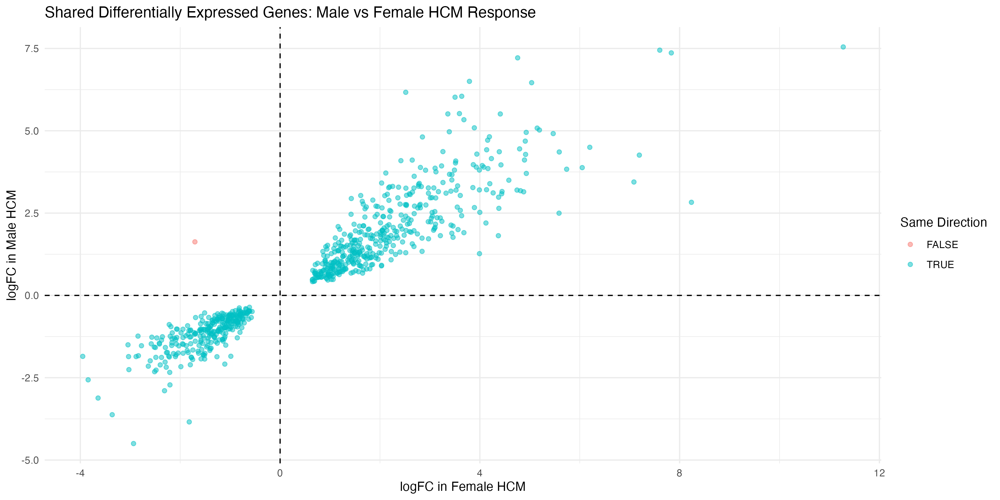
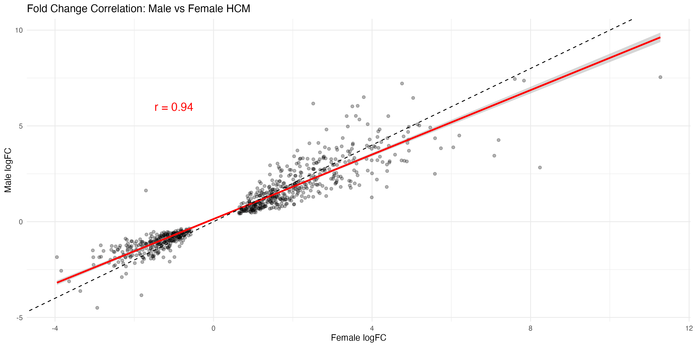
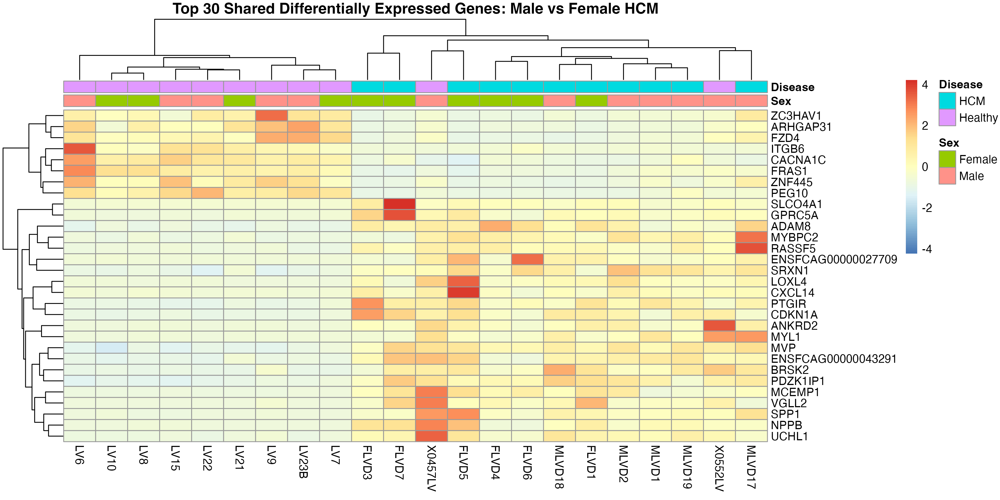
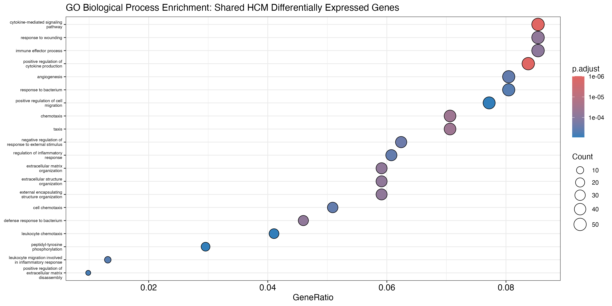
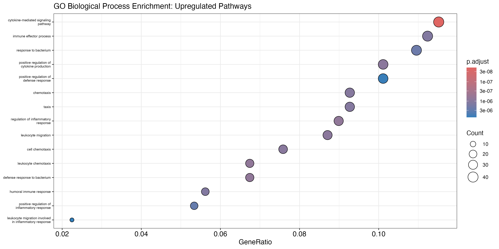
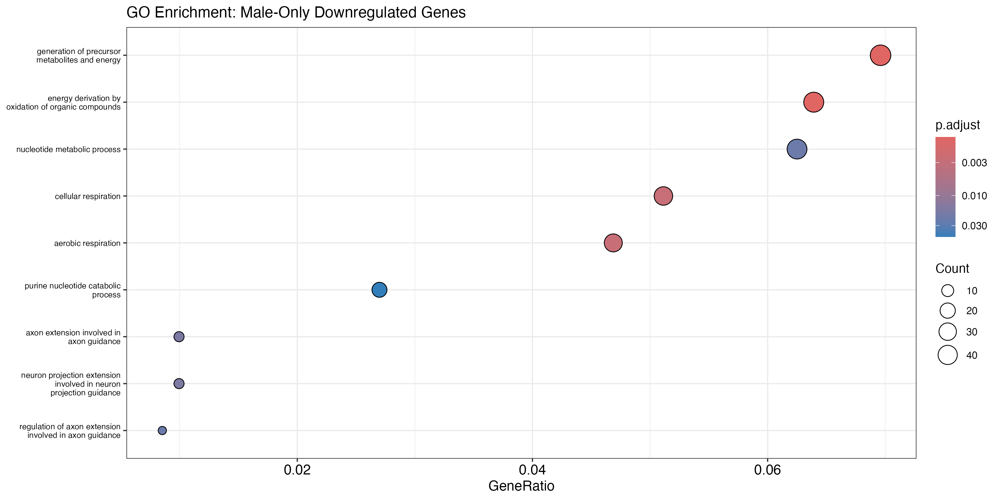
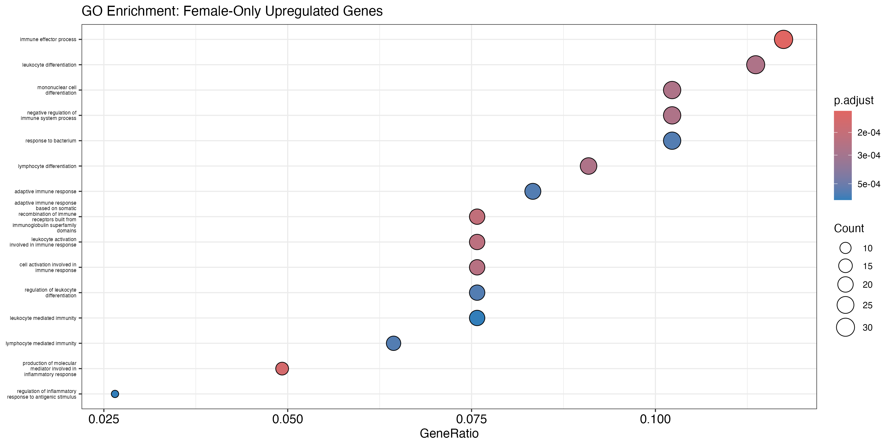
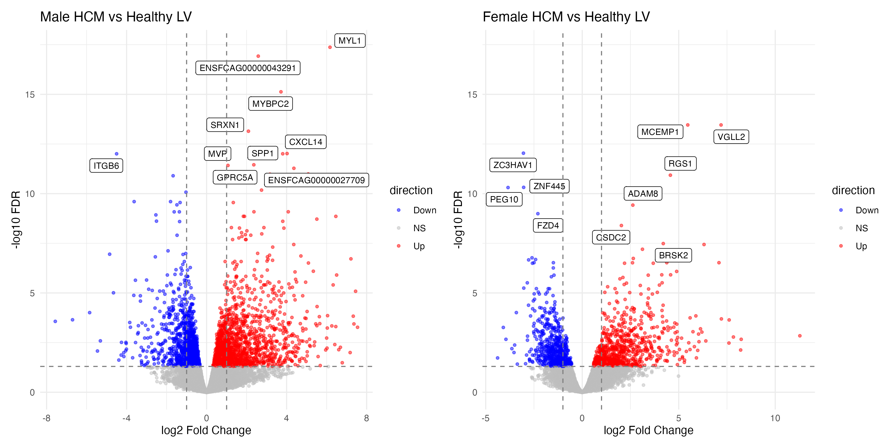
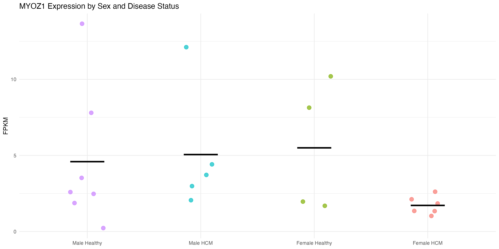
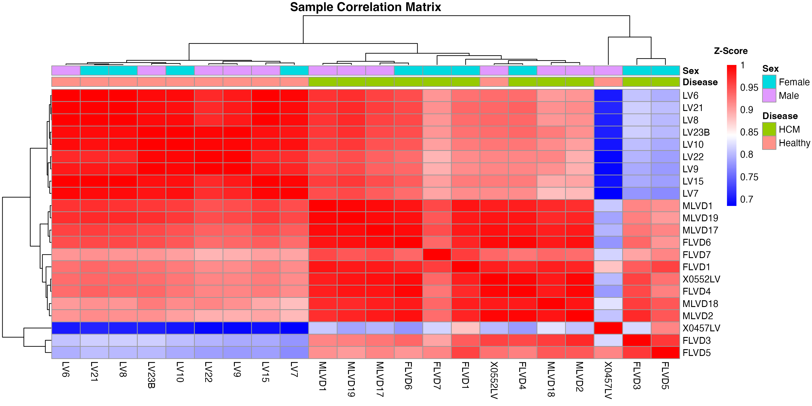

# Feline HCM Sex-Specific Transcriptome Analysis

An independent reanalysis of publicly available RNAseq data examining sex-specific transcriptional patterns in feline Hypertrophic Cardiomyopathy (HCM), with the original publication [1] strictly investigating male feline data.

**Data Source:** NCBI GSE275971 (Joshua et al. 2025, *International Journal of Molecular Sciences*)[1]  
**Tools:** R, Bioconductor (edgeR results), clusterProfiler, pheatmap, ggplot2

---

## Background

Hypertrophic cardiomyopathy (HCM) is the most common inherited heart disease in both humans and cats [2], causing abnormal thickening of the heart muscle that impairs its ability to pump blood effectively. Feline HCM is characterized by both primary hypertrophy of the left ventricle and diastolic dysfunction [3] and is considered a model for human HCM [4].

The original study by Joshua et al. (2025) characterized the mRNA and miRNA transcriptome of feline HCM using left ventricular and left atrial tissue from cats, identifying macrophage activation and inflammatory signaling as key features of advanced HCM. However, the original analysis focused exclusively on male cats and explicitly noted the absence of sex-based comparisons as a limitation.

This project directly addresses that gap by performing a comparative analysis of male and female HCM transcriptomes, **aiming to understand if the transcriptional response to HCM is conserved between sexes, or if male and female cats show distinct disease signatures.**

---

## Data

All data were obtained from NCBI GEO accession [GSE275971](https://www.ncbi.nlm.nih.gov/geo/query/acc.cgi?acc=GSE275971).

<br>
  
| Group | Male | Female |
|-------|------|--------|
| HCM samples | 5 | 6 |
| Healthy controls | 7 | 4 |
| **Total** | **12** | **10** |

<p><i>Table 1: Feline Sample Overview</i></p>

<br>

**Tissue:** Left Ventricle (LV), selected due to the primary HCM characterization as hypertrophy in the LV (vs. the Left Atrium)

**Age:** While the available data includes young vs. adult comparisons, this analysis strictly focuses on the adult HCM vs. adult healthy data to isolate sex differences and avoid age-based confounding. Future analyses could compare age as a variable to better understand HCM as a whole.

**Pre-processing:** STAR alignment, HTSeq counts, edgeR differential expression (performed by original authors)  

This secondary analysis uses the processed supplementary Excel files provided by the original authors.

---

## Methods

All analyses were performed in R. Processed differential expression results (FPKM values, logFC, FDR) were downloaded directly from GEO using the `GEOquery` package.

**Note:**
Throughout this analysis, differential expression is reported as log2 fold change (logFC) with Benjamini-Hochberg adjusted p-values (False Discovery Rate, FDR). Expression values are reported as FPKM (Fragments Per Kilobase of transcript per Million mapped reads). A significance threshold of FDR < 0.05 was applied unless otherwise noted.

**Key steps:**<br>
**1. Setup:** necessary packages and libraries were installed<br>
**2. Data Loading:** supplementary data were loaded and separated by sex<br>
**3. Data Cleaning:** columns stored as character strings were converted to numerical values, sample columns were defined, and sample data were checked for duplicates and inconsistencies<br>
**4. Differential Expression Overview:** significant genes were identified at FDR < 0.05 and validated against known HCM causal genes<br>
**5. Sex Comparisons:** shared significant genes were identified with an inner join. Directional concordance, fold change correlation, key genes of interest, and outliers were assessed<br>
**6. Data Visualization:** volcano plots, heatmaps, directional concordance scatter plot, fold change scatter plot<br>
**7. Pathway Enrichment & Additional Enrichment Plots:** GO Biological Process enrichment with clusterProfiler using human orthologs as a proxy for cats<br>
**8. Sample Quality Control:** sample correlation matrix (for additional quality checks, see Section 3: Data Cleaning and the outlier investigation in Section 5: Sex Comparisons)

**Gene Selection Methodology:** Genes of interest (SPP1, MYBPC2, MCEMP1, ADAM8, CXCL14, NPPB) were selected from the most differentially expressed genes shared across sexes, based on both statistical significance and prior evidence linking them to cardiac biology, hypertrophic cardiomyopathy, or myocardial remodeling [5-10] (see Table 4 for additional details). Other highly significant genes (e.g., ENSFCAG00000432, SRXN1, VGLL2, ZNF445) were not investigated further due to poor characterization in cardiac disease and unclear roles in HCM. This targeted selection is acknowledged as a potential source of bias and could be improved with further investigation.

---

## Key Findings

### 1. The HCM transcriptional response is highly conserved between sexes
Of the 730 genes reaching significance in both male and female cats, 729 (99.9%) were regulated in the same direction (Figure 1). Additionally, fold changes were highly correlated between sexes (Pearson r = 0.94, Spearman rho = 0.95, both p < 2.2e-16; Figure 2), indicating that genes exhibiting larger transcriptional changes in one sex generally exhibited similarly sized changes in the other sex. The closeness of the Pearson and Spearman correlations indicates that this relationship between sexes is robust and not significantly impacted by outliers or non-normality. Altogether, these findings demonstrate that male and female cats with HCM exhibit highly consistent transcriptional responses.

<br>


<p align="center"><i>Figure 1: Directional Concordance of Differential Expression between Male and Female Cats with HCM</i></p>

<br>
<br>


<p align="center"><i>Figure 2: Fold Change Correlation (Pearson) between Male and Female Cats with HCM</i></p>

<br>

The top 30 shared differentially expressed genes, ranked by normalized FDR values across both sexes, show consistent expression patterns with samples clustering primarily by disease status rather than sex, further supporting transcriptional conservation of the HCM response across male and female cats (Figure 3). 

<br>


<p align="center"><i>Figure 3: Heatmap of the Top 30 Shared Differentially Expressed Genes in Male vs. Female Cats with HCM</i></p>

<br>

Notably, two male healthy controls (X0457LV, X0552LV) cluster with the HCM samples rather than the healthy controls. As detailed in Table 2, both of these samples exhibited elevated expression of HCM marker genes relative to other healthy controls, especially NPPB and SPP1. Additionally, these samples also showed elevated values of MYOZ1 compared to both HCM and healthy samples, further complicating their clustering. See Table 4 for more details on the role of NPPB and SPP1 in HCM. See Key Finding #5 for more details on MYOZ1.

These gene expressions potentially suggest subclinical HCM in both cats at the time of sampling, as their transcriptional profiles more closely resemble HCM than healthy tissue. Subclinical status cannot be confirmed by the given data, and therefore, these samples are retained in the analysis as healthy samples. However, they represent an important consideration that the healthy control group may be impacted by undiagnosed HCM cases, which could potentially reduce the calculated magnitude of differential expression. See the Limitations section for further discussion.

<br>

<div align="center">
  
| Gene | X0457LV | X0552LV | HCM Male Avg. | Healthy Male Avg. (excluding X0457LV, X0552LV) |
|:-------:|:------:|:--------:|:--------:|:--------:|
| NPPB | 2424 | 398 | 474.9 | 21.7 |
| SPP1 | 254 | 64.9 | 88.7 | 7.7 |
| MYOZ1 | 13.7 | 7.80 | 5.1 | 2.1 |

</div>
<p align="center"><i>Table 2: Elevated Gene Expression in two Potentially Subclinical HCM Samples (FPKM)</i></p>

### 2. Inflammatory and immune recruitment pathways dominate the HCM signature
Seven GO biological enrichment process analyses were performed to characterize the transcriptional signature of feline HCM at multiple levels of detail. Each analysis used a background universe of all genes tested in the relevant subset and human ortholog annotations (org.Hs.eg.db) as a proxy for incomplete feline annotation coverage (see Limitations). Of these analyses, four elicited significant results (shared HCM enrichment, upregulated HCM enrichment, male downregulated HCM enrichment, and female upregulated enrichment). Downregulated HCM enrichment, male upregulated enrichment, and female downregulated enrichment analyses were not significantly different. 

#### a) Shared HCM Genes (all directions)
GO enrichment analysis of the 730 genes (Figure 4) differentially expressed in both male and female cats revealed enrichment of biological processes related to cytokine-mediated signaling, response to wounding, immune effector processes, positive regulation of cytokine production, angiogenesis, response to bacteria, and positive regulation of cell migration. Collectively, these observed pathways indicate that the transcriptional response shared between male and female cats with HCM is strongly associated with immune activation and tissue remodeling. While this analysis does not identify the specific cell types driving these processes, the enriched pathways are consistent with the macrophage-associated inflammatory remodeling described by Joshua et al. [1], suggesting that inflammatory signaling is a conserved feature of feline HCM across both sexes.

<br>


<p align="center"><i>Figure 4: GO Biological Process Enrichment for Shared Differentially Expressed HCM Genes</i></p>

<br>

#### b) Shared Upregulated Genes
GO enrichment analysis of the shared genes that were significantly upregulated in both male and female cats (Figure 5) showed enrichment of biological processes related to cytokine-mediated signaling, immune effector processes, response to bacteria, positive regulation of cytokine production, and positive regulation of defense response. Together, these enriched pathways indicate that genes consistently upregulated in HCM are predominantly related to immune activation and inflammatory signaling pathways. These findings closely parallel those of Joshua et al., who identified activation of inflammatory pathways, cytokine regulators (such as TNFα and IL1β), and macrophage-related signaling in feline HCM [1], suggesting that immune activation and inflammatory signaling are conserved features of feline HCM, regardless of sex.

<br>


<p align="center"><i>Figure 5: GO Biological Process Enrichment for Upregulated Differentially Expressed HCM Genes</i></p>

<br>

#### c) Shared Downregulated Genes
GO enrichment analysis of the shared genes that were significantly downregulated in both male and female cats did not identify significant biological processes after background universe correction at the standard FDR < 0.05 threshold. At a relaxed threshold of FDR < 0.10, weak enrichment was observed for cardiac development and contractile pathways, such as heart morphogenesis, contractile actin filament assembly, and stress fiber assembly. These findings could potentially indicate altered expression of genes related to cardiac structure and contractile function, but are less prominent than the upregulated inflammatory and immune responses. Eye development pathways were also enriched, but likely reflect GO annotation overlap rather than a genuine biological signal. Overall, the lack of significant downregulated pathways suggests that the sex-conserved transcriptional response in HCM is primarily characterized by immune and inflammatory activation, rather than cardiac pathway suppression.

#### d) Male-only Downregulated Genes
GO enrichment analysis of male-only downregulated genes showed significant enrichment for the generation of precursor metabolites and energy, energy derivation by oxidation, nucleotide metabolic processes, cellular respiration, and aerobic respiration (Figure 6). These observed enriched pathways suggest that HCM in male cats exhibits reduced expression of genes involved in mitochondrial metabolism and energy production. The heart significantly relies on mitochondrial energy production to sustain healthy function [11], making impaired metabolic pathways consequential. The enrichment of these terms specifically in male-only downregulated genes potentially indicates that male cats experience more pronounced mitochondrial and metabolic dysfunction in HCM. However, this finding should be interpreted cautiously, as the larger male control group (7 males vs. 4 females) provides increased statistical power, meaning some male-only genes may be reflecting detection sensitivity rather than true sex-specific disease outcomes. Further investigation in a larger, balanced population is needed to confirm these observations.

<br>


<p align="center"><i>Figure 6: GO Biological Process Enrichment for Male Downregulated Differentially Expressed HCM Genes</i></p>

<br>

#### e) Female-only Upregulated Genes
GO enrichment analysis of female-only upregulated genes showed significant enrichment for immune effector process, leukocyte differentiation, mononuclear cell differentiation, negative regulation of immune system process, and response to bacterium (Figure 7). Together, these terms suggest that HCM in female cats is associated with a more pronounced immune response beyond the shared inflammatory and immune activation observed in both sexes. Despite fewer healthy controls (4 females vs. 7 males), these genes reached significance, suggesting the female-specific immune signal is relatively strong. However, reduced reliability from a small baseline sample limits confidence in the observed results. As with the male-only results, these findings should therefore be validated in a larger, balanced population before drawing firm conclusions about female-specific immune signals in feline HCM.

<br>


<p align="center"><i>Figure 7: GO Biological Process Enrichment for Female Upregulated Differentially Expressed HCM Genes</i></p>

<br>

#### f) Overall Narrative
Taken together, the GO enrichment analyses support a model where feline HCM is characterized by a highly conserved core inflammatory, immune, and remodeling signature shared by male and female cats, with an additional layer of sex-specific divergence: male cats exhibit an additional loss of metabolic and energy production pathways, while female cats exhibit additional immune activation pathways. This suggests that HCM may affect cardiac energy metabolism more severely in male cats and trigger stronger adaptive immunity in female cats, a potentially novel finding that requires additional validation in larger sample populations.

### 3. Known HCM causal genes show modest dysregulation
Select HCM causal genes showed modest but still detectable dysregulation across male and female HCM samples (Table 3). MYH7 was significantly downregulated in both sexes, and MYBPC3 reached significance in males, while the majority of changes were insignificant. Particularly, the fold change and magnitude of significance of these causal genes were substantially smaller than the top inflammatory and remodeling genes (see Table 4 in Key Finding #4). This could suggest that in advanced feline HCM, the transcriptional landscape is dominated by downstream inflammatory responses rather than primary sarcomeric gene dysregulation. This is consistent with the established narrative of HCM progression, where initial sarcomeric mutations trigger secondary inflammatory responses that ultimately increase disease severity, including hypertrophic remodeling [12].

<br>

<div align="center">
  
| Gene | Relevance [7,13,17-21] | Female HCM logFC | Male HCM logFC | Female HCM FDR | Male HCM FDR |
|:-------:|:------:|:--------:|:--------:|:--------:|:--------:|
| MYBPC3 | Encodes cardiac myosin binding protein C, which regulates contractile force in the heart, and its variants are the most common genetic cause of HCM | -0.551| -0.583 | .226| 0.0129 |
| TNNT2  | Encodes cardiac troponin T and is linked to heart structural changes and severe arrhythmias | -0.239 | -0.212 | .703 | 0.466 |
| MYH7 | Involved in cardiac muscle contraction and is linked to abnormal thickening of cardiac walls in HCM | -0.985 | -0.969 | .00226 | 0.0000293 |
| MYL2 | Direct role in regulating myosin, controlling how the heart contracts, and is also linked to hypertrophy | 0.114 | -0.082 | .908 | 0.831 |
| ACTC1 | Encodes α-actin, a key component for the cardiac filaments, and is related to muscle tension in HCM | 0.120 | 0.173 | .876| 0.765 |
| TPM1 | Encodes α-tropomyosin and controls myosin binding availability, which dictates calcium-dependent cardiac contractions | 0.260 | 0.163 | .642 | 0.638 |
| MYL3 | Encodes myosin essential light chain (ELC), a key structural component for the myosin head, which impacts myosin kinetics and heart hypercontractility in HCM | -0.0416 | -0.174 | .961 | 0.500 |

</div>
<p align="center"><i>Table 3: Known Causal HCM Genes in Male and Female HCM Cats</i></p>

<br>

### 4. Core HCM disease markers are consistently upregulated in both sexes, but the most extreme transcriptional changes reflect sex-specific nuances
SPP1, MYBPC2, MCEMP1, ADAM8, CXCL14, and NPPB were evaluated as key genes of interest based on statistical significance and known relevance to HCM and/or cardiac disease. All of these genes were significantly upregulated (FDR < 0.05) in both male and female HCM cats (Table 4). Notably, NPPB encodes BNP, the standard clinical biomarker for heart failure diagnosis in humans [6], and SPP1 encodes osteopontin, which is linked to cardiac fibrosis and macrophage activation [5]. 

<br>

<div align="center">
  
| Gene | Relevance [5-10] | Female HCM logFC | Male HCM logFC | Female HCM FDR | Male HCM FDR |
|:-------:|:------:|:--------:|:--------:|:--------:|:--------:|
| MYBPC2 | Skeletal muscle parallel of MYBPC3, which is a major HCM causal gene, suggesting that disruption extends beyond cardiac expression | 5.47| 3.72 | 3.47e-14| 7.46e-16 |
| CXCL14 | Chemokine involved in inflammatory and immune cell response of cardiac tissue in HCM | 2.62 | 4.02 | 3.47e-14 | 7.46e-16 |
| SPP1 | Encodes osteopontin and drives cardiac fibrosis and remodeling, which are key aspects of human heart failure | 3.49 | 3.80 | 5.79e-5 | 9.83e-13 |
| NPPB | Encordes BNP, the primary biomarker for heart failure in humans, and is a key tool in assessing disease severity | 5.15 | 5.08 | 1.89e-3 | 1.03e-11 |
| MCEMP1 | Known biomarker for immune and inflammatory responses, linked to macrophage activation | 3.51 | 4.91 | 1.39e-2 | 1.84e-4 |
| ADAM8 | Inflammatory and tissue remodeling enzyme driving myocardial fibrosis and is significantly upregulated in cardiac stress/failure | 2.12 | 1.92 | 3.57e-2 | 1.85e-4 |

</div>

<p align="center"><i>Table 4: Key HCM Genes of Interest in Male and Female HCM Cats</i></p>

<br>

Additionally, male HCM cats showed a broader transcriptional response overall, with ~2800 significant genes compared to ~1500 in female HCM cats, and more extreme fold changes clearly visible in the volcano plots (Figure 8). However, this may reflect the larger number of healthy controls in the male cohort (7 vs. 4), giving the male analysis greater statistical power, not necessarily indicating a stronger biological response. Many genes reached higher significance in male vs. female cats, even with similar fold changes. Whether this reflects true sex differences or statistical power differences cannot be determined without additional data.

<br>


<p align="center"><i>Figure 8: Volcano Plots for Male vs. Female Cats with HCM</i></p>

<br>

Notably, there was no overlap between the top 10 most significant genes in males and the top 10 most significant genes in females, despite the high overall conservation of the transcriptional response. Male-specific top hits included sarcomeric (MYBPC2) and oxidative stress response genes (SRXN1), while female-specific top hits were enriched for immune and inflammatory regulators (MCEMP1, ADAM8, RGS1) [7,8,9,14,15]. This pattern is consistent with the sex-specific GO enrichment observations in Key Finding #2, where male-only significant genes were enriched for metabolic pathways, while female-only significant genes were enriched for immune activation. These differences suggest that while the core HCM response is shared, the most extreme transcriptional changes are meaningfully different between sexes.


### 5. MYOZ1 is the only detected sex-discordant gene, which could reflect real sex differences or small sample variability
MYOZ1 (Myozenin-1) is a sarcomeric protein and negative regulator of calcineurin, an enzyme that has been linked, when overactive, to the thickening of cardiac walls [16]. MYOZ1 is the only evaluated gene to exhibit opposing logFC directions between sexes (-1.71 in male cats, +1.63 in female cats). Subgroup analyses revealed that there was not a significant difference in MYOZ1 expression between healthy male and female groups (Wilcoxon p = 0.93), but MYOZ1 expression was significantly different between HCM male and female groups (Wilcoxon p = 0.017). However, small sample sizes and high intra-group variability in male healthy, female healthy, and male HCM cats limit the confidence in this finding (Figure 9). Further investigation in a larger cohort is required to understand whether these MYOZ1 differences are indicative of a genuine sex discordance in HCM response or are instead an effect of small sample sizes.

<br>


<p align="center"><i>Figure 9: MYOZ1 Expression by Sex and Disease Status</i></p>

<br>

### 6. Sample correlation analysis confirms disease-driven clustering
When evaluating sample correlation using all 730 shared significant genes, the clustering pattern is consistent with that of the top 30 differentially expressed genes (Figure 3). Samples again primarily cluster by disease status rather than sex (Figure 10), further supporting the conservation of the HCM transcriptional response across male and female cats. Two healthy male samples clustered with the HCM samples, likely due to their elevated expression of HCM marker genes, as discussed in Key Finding #1 (Table 2) and the Limitations section.

<br>


<p align="center"><i>Figure 10: Heatmap of Sample Correlation</i></p>

<br>

### 7. Overall Conclusions and Next Steps
This secondary analysis of published feline HCM data illustrates a nuanced picture of sex-specific responses. The core transcriptional response in feline HCM, characterized by strong inflammatory and immune activation, cytokine signaling, and hypertrophic remodeling, is highly conserved between male and female cats, with 99.9% of shared significant genes changing in the same direction and fold changes correlating at r = 0.94. These results suggest that the key mechanisms behind feline HCM, previously characterized exclusively in male cats (Joshua et al.), are not sex-dependent at the fundamental level.

However, meaningful sex-specific expression emerges at the extremes of the HCM transcriptional response. Male cats exhibit additional downregulation of mitochondrial energy and metabolism pathways, while female cats show additional upregulation of adaptive immune pathways. Additionally, the most significantly dysregulated genes had no overlap between sexes despite the shared core response. Though the data showed extremely strong directional concordance, one gene, MYOZ1, exhibited potentially sex-discordant regulation, warranting further evaluation.

Future work should prioritize left atrial tissue comparisons to determine whether the observed sex conservation extends across cardiac chambers, as the original publication identified meaningful regional differences. Reanalysis with raw count data and balanced sample sizes, including potential downsampling, would provide more statistically sound sex comparisons. Larger cohorts with age-matched controls, breed information, and longitudinal outcomes would also enable more definitive conclusions about sex-specific HCM biology in cats and potential translational relevance for humans. See below for the discussed limitations.

---

## Limitations

- **Age Confounding (discussed by Joshua et al.):** Healthy cats were approximately 1.5 years old, while HCM cats ranged from 3-15 years. Some observed gene expression differences may reflect normal cardiac aging rather than HCM implications.
- **Unequal Sample Sizes:** The male group includes more healthy controls (7 vs. 4), which gives the male analysis greater statistical power and sensitivity to detect modest changes in expression. As a result, the 730 shared genes that were investigated likely represent the subset of responses that are detectable in both sex samples, rather than the full conserved transcriptome. A sensitivity analysis using downsampled male controls to match the female sample size could be conducted to better understand any implications of the sample imbalance.
- **Separate Differential Expression Analyses:** Male and female results were sourced from independent edgeR analyses with different baseline groups. A single integrated analysis may be more rigorous to understand sex-specific patterns, but requires raw count data.
- **FPKM Normalization:** Pre-computed differential expression results were assessed instead of raw counts. While FPKM is not ideal for edgeR, which prefers raw counts, this reflects the original authors' methodology and is outside the scope of the reanalysis.
- **Shared Genes Framing:** Genes identified as "shared" between male and female cats are those reaching statistical significance (FDR < 0.05) in both independent male and female analyses. This is not equivalent to the shared biological responses across all genes.
- **Human Ortholog Mapping:** GO enrichment in this reanalysis relied on human gene annotations (org.Hs.eg.db) due to limited feline annotation resources. As a proxy, gene symbols were mapped to human orthologs, which may introduce mapping bias and result in incomplete enrichment analyses for cat-specific or ill-annotated genes. Although the background gene universe was defined using the feline dataset to help mitigate these limitations, some genes may still fail to map correctly or may lack corresponding human orthologs.
- **Left Ventricle Only:** This reanalysis focused strictly on left ventricle (LV) comparisons. The original publication identified chamber-specific differences between the LV and left atrium (LA), and as a next step, sex conservation in the left atrium should be investigated.
- **Potential Preclinical HCM Male Samples:** As discussed in Key Finding #1, two healthy male samples (X0457LV and X0552LV) exhibited elevated expression of HCM marker genes and were the only two samples to cluster with the opposite disease status. Due to HCM-like expression and clustering, it is a possibility that these two male samples had undiagnosed HCM, potentially impacting the healthy control group. Without additional data, preclinical HCM cannot be confirmed, but it is an important nuance to consider when understanding the evaluated transcriptional differences in HCM vs. healthy felines.

---

## How to Reproduce

**Requirements:** R (≥ 4.0), the following packages:

```r
install.packages("BiocManager")
BiocManager::install(c("GEOquery", "clusterProfiler", "org.Hs.eg.db"))
install.packages(c("tidyverse", "readxl", "ggplot2", "pheatmap", "ggrepel", "patchwork"))
```

**Steps:**
1. Clone this repository
2. Uncomment the `getGEOSuppFiles("GSE275971")` line in `Feline_HCM_analysis.R` and run it once to download the data
3. Comment it back out and run the full script

Note: The raw data files are not included in this repository as they are not currently publicly available. The supplementary data used can be found on NCBI GEO ([GSE275971](https://www.ncbi.nlm.nih.gov/geo/query/acc.cgi?acc=GSE275971)).

---

## References

[1] Joshua, J., Caswell, J. L., Kipar, A., O’Sullivan, M. L., Wood, G., & Fonfara, S. (2025). Integrated MicroRNA–mRNA Sequencing Analysis Identifies Regulators and Networks Involved in Feline Hypertrophic Cardiomyopathy. International Journal of Molecular Sciences, 26(14), 6764. https://doi.org/10.3390/ijms26146764

[2] Gil-Ortuño, C., Sebastián-Marcos, P., Sabater-Molina, M., Nicolas-Rocamora, E., Gimeno-Blanes, J. R., & Fernández Del Palacio, M. J. (2020). Genetics of feline hypertrophic cardiomyopathy. Clinical genetics, 98(3), 203–214. https://doi.org/10.1111/cge.13743

[3] Kittleson, M. D., & Côté, E. (2021). The feline cardiomyopathies: 2. Hypertrophic cardiomyopathy. Journal of Feline Medicine and Surgery, 23(11), 1028–1051. https://doi.org/10.1177/1098612X211020162

[4] Freeman, L. M., Rush, J. E., Stern, J. A., Huggins, G. S., & Maron, M. S. (2017). Feline Hypertrophic Cardiomyopathy: A Spontaneous Large Animal Model of Human HCM. Cardiology research, 8(4), 139–142. https://doi.org/10.14740/cr578w

[5] Rosenberg, M., Zugck, C., Nelles, M., Juenger, C., Frank, D., Remppis, A., Giannitsis, E., Katus, H. A., & Frey, N. (2008). Osteopontin, a new prognostic biomarker in patients with chronic heart failure. Circulation. Heart failure, 1(1), 43–49. https://doi.org/10.1161/CIRCHEARTFAILURE.107.746172

[6] Maisel, A. S., Krishnaswamy, P., Nowak, R. M., McCord, J., Hollander, J. E., Duc, P., Omland, T., Storrow, A. B., Abraham, W. T., Wu, A. H., Clopton, P., Steg, P. G., Westheim, A., Knudsen, C. W., Perez, A., Kazanegra, R., Herrmann, H. C., McCullough, P. A., & Breathing Not Properly Multinational Study Investigators (2002). Rapid measurement of B-type natriuretic peptide in the emergency diagnosis of heart failure. The New England journal of medicine, 347(3), 161–167. https://doi.org/10.1056/NEJMoa020233

[7] van Dijk, S. J., Dooijes, D., dos Remedios, C., Michels, M., Lamers, J. M., Winegrad, S., Schlossarek, S., Carrier, L., ten Cate, F. J., Stienen, G. J., & van der Velden, J. (2009). Cardiac myosin-binding protein C mutations and hypertrophic cardiomyopathy: haploinsufficiency, deranged phosphorylation, and cardiomyocyte dysfunction. Circulation, 119(11), 1473–1483. https://doi.org/10.1161/CIRCULATIONAHA.108.838672

[8] Ji, Z., Guo, J., Zhang, R., Zuo, W., Xu, Y., Qu, Y., Tao, Z., Li, X., Li, Y., Yao, Y., & Ma, G. (2025). ADAM8 deficiency in macrophages promotes cardiac repair after myocardial infarction via ANXA2-mTOR-autophagy pathway. Journal of advanced research, 73, 483–499. https://doi.org/10.1016/j.jare.2024.07.037

[9] Perrot, C. Y., Karampitsakos, T., Unterman, A., Adams, T., Marlin, K., Arsenault, A., Zhao, A., Kaminski, N., Katlaps, G., Patel, K., Bandyopadhyay, D., & Herazo-Maya, J. D. (2023). Mast-Cell Expressed Membrane Protein-1 (MCEMP1) is expressed in classical monocytes and alveolar macrophages in Idiopathic Pulmonary Fibrosis and regulates cell chemotaxis, adhesion, and migration in a TGFβ dependent manner. bioRxiv : the preprint server for biology, 2023.10.07.561349. https://doi.org/10.1101/2023.10.07.561349

[10] Zheng, Y., Gu, N., Qiu, K., Tian, F., Chen, L., Chen, Y., & Zeng, L. (2025). The role and mechanism study of Cxcl14 in chronic critically ill cardiac dysfunction. Biochemical and biophysical research communications, 754, 151525. https://doi.org/10.1016/j.bbrc.2025.151525

[11] Bertero, E., & Maack, C. (2018). Metabolic remodelling in heart failure. Nature reviews. Cardiology, 15(8), 457–470. https://doi.org/10.1038/s41569-018-0044-6

[12] van der Velden, J., & Stienen, G. J. M. (2019). Cardiac Disorders and Pathophysiology of Sarcomeric Proteins. Physiological reviews, 99(1), 381–426. https://doi.org/10.1152/physrev.00040.2017

[13] Pham, J. H., Giudicessi, J. R., Tweet, M. S., Boucher, L., Newman, D. B., & Geske, J. B. (2023). Tale of two hearts: a TNNT2 hypertrophic cardiomyopathy case report. Frontiers in cardiovascular medicine, 10, 1167256. https://doi.org/10.3389/fcvm.2023.1167256

[14] Garcia, Y. E., Sjögren, B., & Osei-Owusu, P. (2025). G protein regulation by RGS proteins in the pathophysiology of dilated cardiomyopathy. American journal of physiology. Heart and circulatory physiology, 328(2), H348–H360. https://doi.org/10.1152/ajpheart.00653.2024

[15] National Center for Biotechnology Information. (2026). SRXN1 sulfiredoxin 1 [Homo sapiens (human)] (Gene ID: 140809). NCBI Gene. https://www.ncbi.nlm.nih.gov/gene/140809

[16] National Center for Biotechnology Information. (2026). MYOZ1 myozenin 1 [Homo sapiens (human)] (Gene ID: 58529). NCBI Gene. https://www.ncbi.nlm.nih.gov/gene/58529

[17] Marian A. J. (2021). Molecular Genetic Basis of Hypertrophic Cardiomyopathy. Circulation research, 128(10), 1533–1553. https://doi.org/10.1161/CIRCRESAHA.121.318346

[18] C. Yuan,K. Kazmierczak,J. Liang,W. Ma,T.C. Irving, & D. Szczesna-Cordary,  Molecular basis of force-pCa relation in MYL2 cardiomyopathy mice: Role of the super-relaxed state of myosin, Proc. Natl. Acad. Sci. U.S.A. 119 (8) e2110328119, https://doi.org/10.1073/pnas.2110328119 (2022).

[19] Despond, E. A., & Dawson, J. F. (2018). Classifying Cardiac Actin Mutations Associated With Hypertrophic Cardiomyopathy. Frontiers in physiology, 9, 405. https://doi.org/10.3389/fphys.2018.00405

[20] Halder, S. S., Rynkiewicz, M. J., Creso, J. G., Sewanan, L. R., Howland, L., Moore, J. R., Lehman, W., & Campbell, S. G. (2023). Mechanisms of pathogenicity in the hypertrophic cardiomyopathy-associated TPM1 variant S215L. PNAS nexus, 2(3), pgad011. https://doi.org/10.1093/pnasnexus/pgad011

[21] Andersen, P. S., Hedley, P. L., Page, S. P., Syrris, P., Moolman-Smook, J. C., McKenna, W. J., Elliott, P. M., & Christiansen, M. (2012). A novel Myosin essential light chain mutation causes hypertrophic cardiomyopathy with late onset and low expressivity. Biochemistry research international, 2012, 685108. https://doi.org/10.1155/2012/685108

---

## About

This independent bioinformatics portfolio project demonstrates the ability to design and execute an RNAseq analysis, including public data acquisition, quality control, exploratory data analysis, differential expression analysis, pathway enrichment analysis, and critical evaluation of study design limitations and potential sources of bias.

<i>Inspired by my cats, Lemon and Orange, this project highlights my interest in how bioinformatics can be used to investigate questions in biology, health, and medicine through publicly available data.</i>


